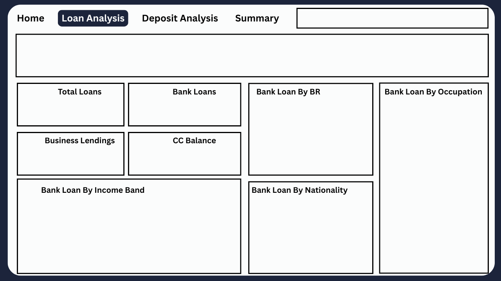

# 🏦 Banking Analytics – End-to-End Data Analytics Project

## 📌 Project Overview

This project is a **complete end-to-end data analytics case study** built on a real-world styled **Banking dataset**. The goal of this project is to demonstrate my ability to handle the **entire data analytics lifecycle** — from raw data understanding and cleaning to advanced analysis and executive-level dashboarding using **Power BI**.

The project is designed to reflect how data analytics is applied in the **banking and financial services domain**, focusing on **customers, deposits, loans, risk, and business lending insights**.

---

## 🎯 Objectives

* Understand customer banking behavior using data
* Analyze deposits, loans, and credit usage
* Identify high-value and high-risk customers
* Build interactive, decision-oriented dashboards
* Showcase industry-ready analytics and visualization skills

---

## 🛠️ Tools & Technologies Used

| Category            | Tools                                       |
| ------------------- | ------------------------------------------- |
| Data Cleaning & EDA | Python (Pandas, NumPy, Matplotlib, Seaborn) |
| SQL                 | MySQL (Filtering, Aggregations, Joins)      |
| Visualization       | Power BI                                    |
| Documentation       | GitHub README, LinkedIn                     |

---

## 📂 Project Structure

```
📦 Banking-Analytics-Project
 ┣ 📁 data
 ┃ ┗ 📄 Banking.csv
 ┣ 📁 notebooks
 ┃ ┗ 📄 Banking_EDA_Case_Study.ipynb
 ┣ 📁 dashboards
 ┃ ┣ 📄 Bank_Dashboard_Home.png
 ┃ ┣ 📄 Bank_Dashboard_Loan_Page.png
 ┃ ┣ 📄 Bank_Dashboard_Deposit_Page.png
 ┃ ┗ 📄 Bank_Dashboard_Summary_Page.png
 ┣ 📄 Banking_Dashboard.pbix
 ┗ 📄 README.md
```

---

## 🔹 Step 1: Data Understanding & Cleaning

**Key actions performed:**

* Checked missing values and data consistency
* Corrected data types (numeric, categorical, date)
* Standardized categorical columns (Gender, Risk, Relationship)
* Created derived fields such️ as:

  * Customer tenure
  * Risk categories
  * Income bands

📌 *This step ensured data quality and reliability before analysis.*

---

## 🔹 Step 2: SQL-Based Analysis

SQL was used to simulate **real-world database querying**, including:

* Customer segmentation queries
* Deposit and loan aggregations
* Risk-based customer filtering
* Business lending and foreign currency analysis

📌 *This step demonstrates my ability to work with structured databases and business queries.*

---

## 🔹 Step 3: Exploratory Data Analysis (EDA)

EDA was performed using Python to uncover patterns and trends:

* Customer age and income distribution
* Deposit vs loan comparison
* Risk level distribution (1–5 scale)
* Business lending and foreign currency usage

📊 Visualizations included:

* Bar charts
* Donut charts
* Distribution plots

📌 *EDA helped shape the KPIs and dashboards created later.*

---

## 🔹 Step 4: Power BI Dashboard Development

A **4-page interactive Power BI dashboard** was created:

### 🏠 Home Page

* Total Clients
* Total Loans & Deposits
* Savings & Checking Accounts
* High-level banking overview

### 💰 Deposit Analysis

* Total & account-wise deposits
* Deposits by income band
* Deposits by occupation & nationality

### 💳 Loan Analysis

* Total loans & business lending
* Credit card balance
* Loans by income band & occupation

### 📊 Summary Page (Executive View)

A 4×4 KPI grid including:

* Total Clients, Loans, Deposits
* Loan-to-Deposit Ratio
* Avg Age, Tenure, Income
* High Value Customer %
* High Risk Customer %
* Total Business Lending Amount
* Total Foreign Currency Balance

📌 *The summary page is designed for leadership and decision-makers.*

---

## 🔑 Key Business Insights

* A significant portion of loans comes from **medium-income customers**
* **High-risk customers (Risk 4–5)** form a smaller but critical segment
* Business lending contributes heavily to total loan value
* Foreign currency balances indicate premium/global customers

---

## 📸 Dashboard Preview

### Home Page

![Home Dashboard]https://github.com/PM-1102/Banking-Analytics-End-to-End-Project/blob/main/Home.png

### Loan Analysis



### Deposit Analysis


### Summary Page


---

## 🚀 What This Project Demonstrates

* End-to-end data analytics workflow
* Strong business understanding of banking data
* SQL + Python + Power BI integration
* KPI-driven dashboard design
* Interview and industry-ready analytics project

---

## 🔗 Connect With Me

👤 **Prince Mudgal**
🎓 MCA | Aspiring Data Analyst
📊 Skills: SQL, Python, Power BI, Data Visualization

👉 *Feel free to explore, fork, or share feedback!*
